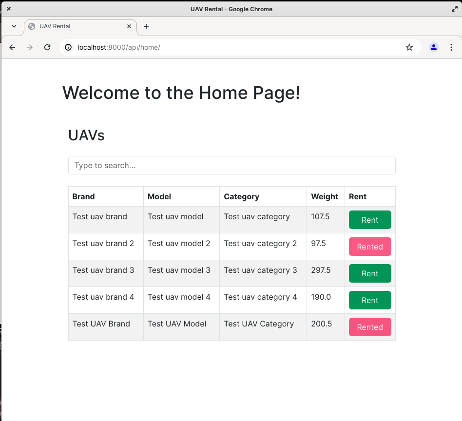

# uav_rental

## Description
Case study project for a company.

**Note:** I received the assignment on Friday afternoon and opened it immediately. I could not 
have guessed that the countdown would start instantly. I couldn't focus on the project enough 
because I had important plans over the weekend. I'm sorry for that.

**Note:** I used one of my previous works, [UserMgmtService](https://github.com/EnesDemirtas/UserMgmtService)
in this project. It was not for a company or sth. I wanted to develop an e-commerce project 
using microservice architecture, different languages/technologies for each service. However, I had
to take a break due to the Erasmus+ program in Poland. Luckily, I used Python/Django for that
service and I used it for this project. **"You never know what you'll need and when"**

**Note:** All apps except users app had been written after the beginning of the assignment.

**Note:** If I would write this project from scratch, I wouldn't use Django's ORM because I hate ORMs.
As you can see in some part of the project, I preferred raw SQL queries. That's how I always do it.
 
 
Example: `

    @api_view(['GET'])
    def get_rented_uavs(request):
        with connection.cursor() as cursor:
            cursor.execute("select uu.id as uav_id, uu.brand as uav_brand, uu.model as uav_model, uu.weight as uav_weight, uu.category as uav_category " +
            "from rentals_rentalrecord rr " +
            "join uavs_uav uu " +
            "on rr.uav_id = uu.id " +
            "where NOW() between rr.start_datetime and rr.end_datetime;")
            rows = cursor.fetchall()
            columns = [col[0] for col in cursor.description]
            result = [dict(zip(columns, row)) for row in rows]
            return Response(data={'data': result}, status=200)`

## Entities

Entity/Component schemas can be found in localhost:8000/api/schema.json along with the endpoints.

- CustomUser
  - id
  - email
  - password
  - name
  - phone
  - is_staff
  - is_active
  - is_verified
  - created_at
  - updated_at
  - addresses

- CustomUserAddress
  - id
  - user
  - street
  - city
  - state
  - zip_code

- UAV
  - id
  - brand
  - model
  - weight
  - category
  - created_at
  - updated_at

- RentalRecord
  - id
  - user (user_id)
  - uav (uav_id)
  - start_datetime
  - end_datetime
  - created_at
  - updated_at

## Endpoints

Endpoints can be found in localhost:8000/api/schema.json.

Postman Collection and Bruno Collection (I prefer this one) can be found under
the [api_collections](https://github.com/EnesDemirtas/uav_rental/tree/main/api_collections) folder. 

